# Projektname
- Video Korrektur für Farbfehlsichtige Personen
- Perception Aware Color Downsampling

# Teammitglieder

- Michel Judasz
- Jan Oliver Nörtemann
- Deborah Höltje

# Projektbeschreibung
## 1. Aufgabe und Abgrenzung

Farbreduktion bei Bildern und Videos werden bei verschiedenen Anwendungen benötigt. Dabei kann es reine Bildkompression sein, Optimierung auf Bildschirme mit geringerem Farbspektrum oder Anpassung auf die verschiedenen Arten der Farbfehlsichtigkeit bei Menschen. 
Um die Farbreduktion möglichst unauffällig zu machen, können wichtige, oder auch salient genannt, Bereiche identifiziert und als Gewichtung verwendet werden. 
Des Weiteren helfen die Saliency Masken dabei Objekte/Fragmente in Bildern und Videos zu Identifizieren, die die Aufmerksamkeit des Betrachters auf sich lenken.
Bei Personen, die an einer Farbfehlsichtigkeit leiden, kann man nicht einfach davon ausgehen, das sie bestimmte Bereiche eines Bildes/Videos als genauso markant wahrnehmen wie Personen, die nicht unter dieser Krankheit leiden.

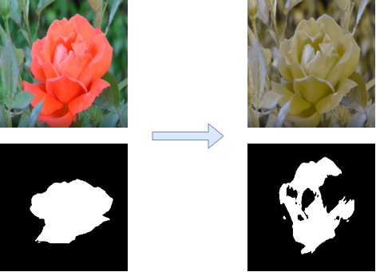

Um dieses Problem zu lösen, haben wir eine Simulation zu unterschiedlichen Typen der Farbfehlsichtigkeit implementiert, welches zu einem Eingabebild ein äquivalentes umgefärbtes Ausgabe Bild erzeugt, wie es aus der Sicht einer farbfehlsichtigen Person wahrgenommen wird (ein Onlinesimulator kann auch unter [[2]](https://www.color-blindness.com/coblis-color-blindness-simulator ) gefunden werden).
Ein einfacher Farbaustausch der (aufgrund der Farbfehlsichtigkeit) nicht erkennbaren Farbbereiche führt nicht zwangsläufig zur Erhaltung der markanten Bereiche und kann so auch die Semantik eines Bildes verändern. Deshalb wollen wir das simulierte Bild nun so umfärben, dass der eigentliche saliente Bereich auch im simulierten Bild salient ist.

Dieses Problem wurde auch von [[1]](https://link.springer.com/article/10.1007/s41095-020-0172-x) angegangen, auf deren Arbeit unser Projekt basiert. Unser Projekt unterscheidet sich von [[1]](https://link.springer.com/article/10.1007/s41095-020-0172-x) Dahingegend, das wir Video als Standardinput erwarten. Des Weiteren haben wir vorgeschlagene Methoden zur Berechnung der Saliency Map durch andere Methoden ausgetauscht, die weiter unten Beschrieben werden.

Perception-aware Color Downsampling: Einfache Farbreduktion sorgt dafür, dass wichtige Farben verloren gehen, bspw. knallrote Lippen in einem Marilyn Monroe Bild/Video. Man könnte saliente, also wichtige Bereiche (Stichwort Saliency) bestimmen und diese als Gewichtung in die Farbreduktion einfließen lassen, um solche Farben zu erhalten. 

Getestet haben wir unseren Ansatz mit unterschiedlichen Videos, welche innerhalb des Videos entweder immer ein oder mehrere Objekte im Fokus haben.

Im weiteren Verlauf wollen wir kurz die Ursache der Farbfehlsichtigkeit klären sowie die unterschiedlichen Typen identifizieren. Weiterhin soll eine Grundlage zum Verständnis unser Verwendeten Algorithmen geschaffen werden sowie eine begründete Erklärung, warum diese notwendig sind, um unser Problem zu lösen. Dafür werden wir uns erst mit den theoretischen Grundlagen beschäftigen und wir werden unser Projekt neben anderen Arbeiten einzuordnen.

## 2. Theoretische Grundlagen und Methoden mit entsprechender Literaturangabe

Unser Projekt basiert stark auf der Arbeit von [[1]](https://link.springer.com/article/10.1007/s41095-020-0172-x), welche wiederum auf einschlägige Arbeiten von [[3]](https://opg.optica.org/josaa/abstract.cfm?URI=josaa-14-10-2647) und [[4]](https://www.inf.ufrgs.br/~oliveira/pubs_files/CVD_Simulation/CVD_Simulation.html) im Bereich der Simulation von Farbfehlsichtigkeit aufbaut.
Im Kurzen wird hier erläutert, wie die Farbfehlsichtigkeit entsteht, welche Typen es gibt und wie [[3]](https://opg.optica.org/josaa/abstract.cfm?URI=josaa-14-10-2647) sowie [[4]](https://www.inf.ufrgs.br/~oliveira/pubs_files/CVD_Simulation/CVD_Simulation.html) eine Simulation dieser konzipiert haben. 

Damit wir unterschiedliche Farben und deren variierenden Intensitäten wahrnehmen können, haben wir in unserem Auge Zapfen und Stäbchen [[7]](https://en.wikipedia.org/wiki/Cone_cell). Die Stäbchen dienen zur Intensitätswahrnehmung des Lichtes, während die Zapfen zur Farbwahrnehmung da sind. Insgesamt gibt es drei verschiedene Typen von Zapfen, welche in L, M, S eingeteilt werden je nachdem ob sie kurze S, mittlere M oder lange L-Wellenlängen wahrnehmen. Es kann jedem Wellenlängenbereich eine bestimmte Farbe zugeordnet werden, wie im unteren Bild aus der Vorlesung zu sehen.

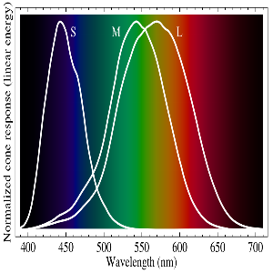

Das Bild kann unter [[7]](https://en.wikipedia.org/wiki/Cone_cell) oder in der 1. Vorlesung gefunden werden.

### 2.1 Simulation der Farbfehlsichtigkeit
Im Falle einer Farbfehlsichtigkeit kommt es dazu, dass sich eine der oben gezeigten L, M oder S Kurven verschiebt. Wie schwer diese Farbfehlsichtigkeit ist, hängt davon ab, um wie viele nm diese Kurven verschoben sind. Ein weiterer Fall der Farbfehlsichtigkeit entsteht, wenn eines der drei Zäpfchen Typen nicht funktioniert oder nicht vorhanden ist.

| Farbfehlsichtigkeit |                                                                 | nach [[3]](https://opg.optica.org/josaa/abstract.cfm?URI=josaa-14-10-2647)             | nach [[4]](https://www.inf.ufrgs.br/~oliveira/pubs_files/CVD_Simulation/CVD_Simulation.html)                      |
|---------------------|-----------------------------------------------------------------|---------------------|-----------------------|
| Deuteranomalie      | Verschiebung der M-Zäpfchen in Richtung des roten Farbbereichs  | 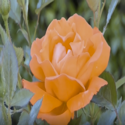       |  |
| Protanomalie        | Verschiebung der L-Zäpfchen in Richtung des grünen Farbbereichs | 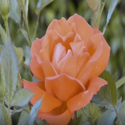          | 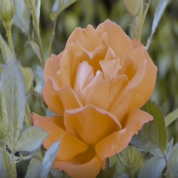 |
| Tritanomalie        | Verschiebung der S-Zäpfchen in Richtung des grünen Farbbereichs | 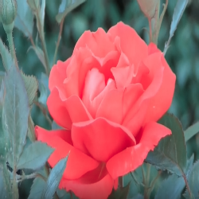          |  |

| Farbfehlsichtigkeit |                                                                 | nach [[3]](https://opg.optica.org/josaa/abstract.cfm?URI=josaa-14-10-2647) | nach [[4]](https://www.inf.ufrgs.br/~oliveira/pubs_files/CVD_Simulation/CVD_Simulation.html)                      |
|---------------------|-----------------------------------------------------------------|---------------------|-----------------------|
| Deuteranopie     | Fehlen der M-Zäpfchen  |         | 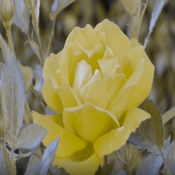 |
| Protanopie        | Fehlen der L-Zäpfchen | 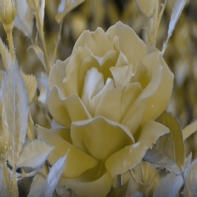         | 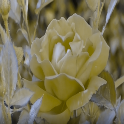 |
| Tritanopie        | Fehlen der S-Zäpfchen | 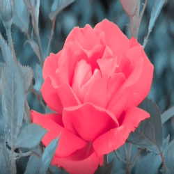          | 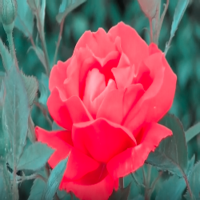 |

Die Arbeiten von [[3]](https://opg.optica.org/josaa/abstract.cfm?URI=josaa-14-10-2647) und [[4]](https://www.inf.ufrgs.br/~oliveira/pubs_files/CVD_Simulation/CVD_Simulation.html) verfolgen jeweils unterschiedliche Ansätze zur Realisierung einer Simulation der oben genannten Farbfehlsichtigkeits Typen. Ein wichtiger Bestandteil dabei ist die Umwandlung vom sRGB Farbraum in den LMS-Farbraum, um in diesem den jeweiligen L, M oder S Anteil abhängig von der jeweiligen Farbfehlischtigkeit zu verändern. Nach [[4]](https://www.inf.ufrgs.br/~oliveira/pubs_files/CVD_Simulation/CVD_Simulation.html) wird jedem Farbwert im LMS-Farbraum ein äquivalenter Wert auf einer Projektionsfläche zugeordnet, wobei diese sich je nach betrachteter Farbfehlsichtigkeit ändert.

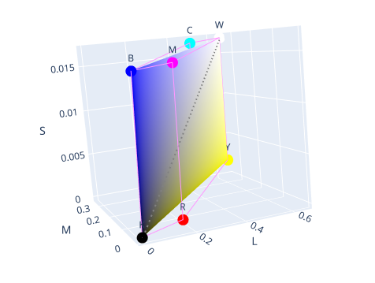
Bild stammt aus [[11]](https://daltonlens.org/understanding-cvd-simulation/#Simulating-dichromacy-in-LMS-(Brettel-1997-and-Vi%C3%A9not-1999))

### 2.2 Saliency Detection

Zur Berechnung einer Saliency Map wurden verschiedene statische Methoden sowie ein Machine Learning basierter Ansatz implementiert und verglichen.
#### 2.2.1 Statische Saliency Methoden

**Frequency tuned saliency detection**

Die Autoren dieser Methode [[13]](README.md#quellen) beabsichtigen, saliente Bereiche mithilfe einer Bandpass Filterung und anschließendem Clustering sowie Thresholding eine Saliency Map mit klaren Objektbegrenzungen zu erstellen. Mit der Annahme, dass es sich bei den höchsten Frequenzen im Bild um Rauschen handelt, aber generell hohe Frequenzen Kanteninformationen enthalten, wird das Bild zunächst mithilfe eines Difference of Gaussian Filters (als Approximierung des Laplacian of Gaussian) bandpass gefiltert. Dazu ein 5x5 Gausskernel mit den folgenden Standardabweichungen angewandt und die beiden Bilder voneinander subtrahiert.

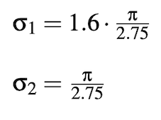

Die Saliency map wird als euklidische Distanz zwischen dem Mittelwert des Lab Bildes (im Lab Farbraum entspricht die euklidische Distanz auch der wahrgenommenen Distanz) sowie den Pixeln des gefilterten Bildes berechnet. 

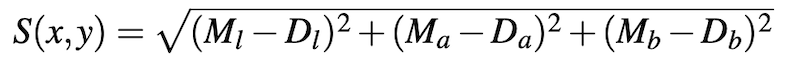 , wobei M der Mittelwert im entsprechenden Channel des Lab Bildes ist und D, der aktuelle Pixel Wert des mit sigma_2 gefilterten Bildes im entsprechenden Farbkanal
des DoG Bildes im entsprechen Farbkanal.

Das resultierende Kantenbild wird dann mithilfe des Mean Shift Algorithmus geclustered, welcher hier den Vorteil hat, dass keine Anzahl an Clustern angenommen werden muss. Folgender adaptiver Threshold binarisiert das Bild schließlich und stellt die entgültige Saliency Maske dar.
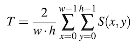 

**Spectral saliency detection**

Diese Methode berechnet eine Saliency Map, indem ein Graustufenbild mit unterschiedlichen, sogenannten center-surround Kernels, gefiltert wird. Die Filter unterscheiden sich in der Größe (scale) s und im Umgebungsparameter sigma. Zusammengefasst, wird der zentrale Pixelwert von dem der Umgebung subtrahiert und vice versa. Pro Filter resultiert eine Submap, welche dann alle zur finalen Saliency Map addiert werden. Details können dem Paper [[14]](README.md#quellen) entnommen werden.

**Spectral residual detection**

Hier werden wichtige Details im Bild im Frequenz Spektrum extrahiert. Dafür wird das Bild mithilfe der Fourier Tranformation in as log Frequenz Spektrum umgewandelt und es werden sogenannte spectral residuals berechnet. Diese sind die Differenz zwischen der log Frequenz und der mittleren Frequenz des ganzen Bildes. Details können dem Paper [[15]](README.md#quellen) entnommen werden.

#### 2.2.2 Machine Learning
Wir verwenden eine Pytorch implementation des  Pyramid Attention Network for Saliency Detection [[16]](README.md#quellen) auf Basis von Zhao et. al  [[17]](README.md#quellen). Dieses neuronale Netz basiert auf dem VGG16 Netz und extrahiert anschließend parallel sowohl high-level globale Features, als auch low level Features um klare Objektgrenzen zu erhalten. Dazu werden bei den low-level Features sogenannte spatial attention Mechanismen verwendet und bei high-level features channel-wisse attention, da man bei low-level Features für gewöhnlich keine starken Unterschiede zwischen den Kanälen zweier Features finden kann.
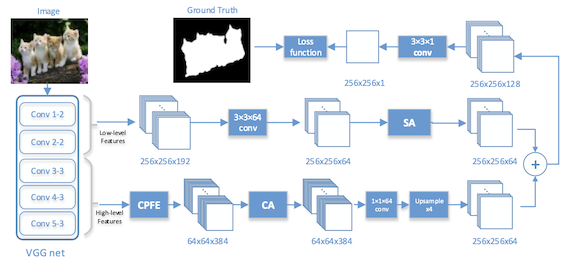

### 2.3 Farbkorrektur des Simulationsbildes

Aufgrund dessen, dass gerade bei Deuteranopie Simulationsbilder entstehen, die die salient Map stark verändern, das heißt die im Original Bild gewesenen Salienten Bereiche sind unter Umständen nach der Simulation nicht mehr salient. Unser Projekt beabsichtigt die im Original befindliche Sallienten Bereiche im Simulationsbild wieder herzustellen, indem genau diese Bereiche im Simulations Bild umgefärbt werden.

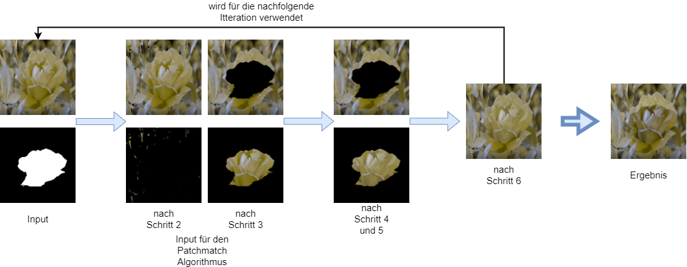

Die Arbeit von [[1]](https://link.springer.com/article/10.1007/s41095-020-0172-x) verwendet dabei einen Algorithmus von [[8]](https://link.springer.com/article/10.1007/s00138-018-01000-w), welcher mithilfe eines Bildes und einer RoI-Maske den entsprechenden Bereich im Bild umfärbt. Im genauen läuft der Algorithmus wie folgt ab:

1. Erstelle eine Saliency Map S von Eingabebild I
2. Definiere zwei Threshold Variablen tau_plus und tau_minus mit Werten im Bereich [0, 1], mit deren Hilfe wir zwei Bilder erstellen (I_plus und I_minus) die die Pixel von I enthalten, welche einen Saliency Wert >= tau_plus oder <= tau_minus haben
3. Erstelle zwei weitere Bilder J1 und J2 auf Basis von I, in dem einen soll nur die RoI enthalten sein, indem anderen alles außer die RoI
4. Führe zweimal den Patchmatch Algorithmus aus [[9]](https://gfx.cs.princeton.edu/pubs/Barnes_2009_PAR/) aus, der einen in [[10]](https://web.ece.ucsb.edu/~psen/melding) eingeführten Vote Schritt einführt
5. Als Ergebnis erhalten wir zwei veränderte Bilder, die eine farbkorrigierte Variante von J1 und J2 darstellen, die jeweils die Prominenten Farben von I_plus und I_minus angenommen haben
6. Die Bilder J1 und J2 werden zu einem Bild J zusammengefügt
7. Daraufhin wird der Algorithmus mit veränderten Werten von tau_plus und tau_minus wiederholt, bis ein gewünschtes Ergebnis erreicht worden ist

#### 2.3.1 Patchmatch und Vote Algorithmus

Der Patchmatch Algorithmus aus [[9]](https://gfx.cs.princeton.edu/pubs/Barnes_2009_PAR/) benötigt zwei Bilder, die wir als Source und Target bezeichnen wollen. Der Algorithmus hat das Ziel, ähnliche Patches, w*w großer Teil eines Bildes zu finden. Als Beispiel könnte sich im Target Bild ein Loch befinden, welches durch den Patchmatch Algorithmus mit einem oder mehreren w*w großen Elementen des Source Bildes gefüllt wird (Inpainting). Dabei wird darauf geachtet, dass sich die vom Source Bild übernommenen Patches auch sinnvoll in das Target Image Integrieren.

Der genaue Ablauf sieht wie folgt aus:

1. Für jedes w*w großes Element im Target Bild finde ein zufällig ausgewähltes w*w großes Element im Source Bild 
2. Schaue für jeden Patch im Target Bild, ob Nachbar Patches eine für den aktuell betrachteten Patch ein besseres Element im Source Bild gefunden haben
3. Für jeden Patch im Target Bild suche im korrespondierenden Patch im Source Bild ob sich in einem vorher festgelegten Umkreis ein besserer Patch befindet
4. Halbiere den abzusuchenden Umkreis und wiederhole 3. bis ein Umkreis von 1 erreicht wurde
5. Wiederhole 3. und 4. für eine festgelegte Anzahl an Iterationen

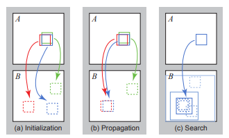
Das Bild stammt aus [[9]](https://gfx.cs.princeton.edu/pubs/Barnes_2009_PAR/)

Am Ende des Patchmatch Algorithmus haben wir für jeden Patch im Target Bild einen approximierenden Patch im Source Bild. Der in [[10]](https://web.ece.ucsb.edu/~psen/melding) eingeführte Vote Schritt rekonstruiert das Target Bild, indem er jedem Pixel im Target Bild den Farbmittelwert des zu ihm gehörenden Patches übernimmt.

#### 2.3.2 Kalibrierung der Parameter tau_plus und tau_minus

Um ein optimales Ergebnis zu erzielen, müssen die vorgestellten Parameter tau_plus und tau_minus kalibriert werden [[8]](https://link.springer.com/article/10.1007/s00138-018-01000-w). Die Parameter erstellen zwei Bilder, welche die most salient Pixel oder die least salient Pixel von I beinhalten. Das Ziel bei dieser Kalibrierung ist es, den Patchmatch Algorithmus dabei zu unterstützen, den gewünschten Bereich in unserer RoI-Maske herausstechen zu lassen und alles nicht darin enthaltene abzuschwächen.

TODO: Beispielbilder einfügen

Die Kalibrierung fußt auf folgenden Gleichungen, welche einen für ein Eingabebild und einen Wert tau_plus einen tau_plus+i berechnen.

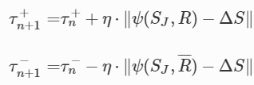

Eta (n) sowie Delta_S sind vorgegebene Werte aus [[8]](https://link.springer.com/article/10.1007/s00138-018-01000-w). psi(S_J, R) beschreibt den Saliency Unterschied aus dem Bild J zwischen den Pixeln in R (RoI Map) und den Pixeln außerhalb von R und kann so berechnet werden.

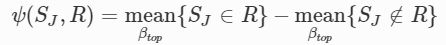

Wir haben die optimalen Werte für theta_plus und theta_minus erreicht, wenn:

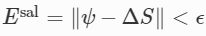

Wobei epsilon = 0.05 ist. Die Bilder der Gleichungen stammen alle aus [[8]](https://link.springer.com/article/10.1007/s00138-018-01000-w)

### 2.4 Farbreduktion
Clusteringverfahren wie k-Means können zur Segmentierung der Farbbereiche eines Bildes, und somit zur Farbreduktion genutzt werden.
Ohne eine gesonderte Betrachtung der hervorstechenden Merkmale eines Bildes und Farben dieser gehen sie bei einer Farbreduktion jedoch verloren.
Um eine gesonderte Behandlung dieser zu ermöglichen, sollen die unterschiedlichen hier entwickelten und importierten Algorithmen zur Berechnung von Saliency Maps genutzt werden.
Hierfür ist es notwendig, eine auf Salienz basierte Gewichtung der Datenbasis für die Clusteringverfahren zu verwenden.

Es soll zudem geprüft werden, ob andere Farbmodelle sich auf Basis salienter Signifikanz besser dafür eignen, farbliche Bereiche in Bezug zur menschlichen Wahrnehmung zu erhalten. 
Unter anderem besitzt so der HSV (Hue, Saturation, Value) nach [[18]](http://www.ijcset.com/docs/IJCSET16-07-09-001.pdf) eine bessere Eignung aufgrund der vorhandenen Ähnlichkeit zur menschlichen Wahrnehmung. 

## 3. Formulierung des Vorgehens / Algorithmen

Die hier beschriebenen Methoden haben das Ziel, die Farbgebung in Bildern/Videos so anzupassen, dass der Fokus aus der Sicht einer an Farbfehlsichtigkeit erkrankten Person an genau der gleichen Stelle liegt wie aus der Sicht einer nicht daran erkrankten Person. Hierfür werden normale Farbbilder in ein farbfehlsichtiges Äquivalent transformiert. Die Resultierenden Bilder können dabei je nach Art und Grad der Farbfehlsichtigkeit variieren. Daraufhin wird ein Recolor Algorithmus angewandt, der mithilfe von Saliency Maps das simulierte Bild so umfärbt, dass der Fokus auf dem gleichen Punkt liegt wie im normalfarbigen Bild. 

Als eingabe wird ein Video verwendet welches Frame für Frame bearbeitet wird.

### 3.1 Simulation der Farbfehlsichtigkeit

Unser Projekt bietet zwei unterschiedliche Methoden zur Erstellung eines Simulationsbildes. Beide Methoden verlangen ein Bild oder im Falle eines Videos ein Frame von diesem.
Beide Methoden funktionieren im Prinzip ähnlich. Sie nehmen ein normales RGB-Farbbild entgegen, welches in ein lineares RGB-Farbbild umgewandelt wird. 

Die Konvertierung in den linearen RGB-Farbbereich ermöglicht das wir Intensität der Farben im gleichem maße verändern wie die Farben selbst (Verdoppelt sich der Farbwert verdoppelt sich auch die Intensität). Danach werden auf jeden Pixel im Bild Matrizen angewendet, deren Berechnung in [[3]](https://opg.optica.org/josaa/abstract.cfm?URI=josaa-14-10-2647) [[4]](https://www.inf.ufrgs.br/~oliveira/pubs_files/CVD_Simulation/CVD_Simulation.html) dargestellt wird, worauf wir ausführlich in Kapitel 2.1 eingegangen sind.
In unserer Implementierung haben wir auf den Beweis dieser Matrizen verzichtet, stattdessen greifen wir auf bereits berechnete für den jeweiligen Typ und Intensität zurück [[5]](https://www.inf.ufrgs.br/~oliveira/pubs_files/CVD_Simulation/CVD_Simulation.html) [[6]](https://github.com/MaPePeR/jsColorblindSimulator). Beide Methoden führen zu unterschiedlichen, aber zufrieden stellenden Ergebnissen.

### 3.2 Saliency Detection
Zur Berechnung der Saliency Mask kann eine der oben genannten Methoden ausgewählt werden.

**Frequency tuned saliency detection**

Im oben genannten Paper, wird bei der Berechnung der Saliency Pixel Werte der Pixelwert vom sigma_2 gefilterten Bild verwendet. Dies hat bei uns jedoch zu schlechteren Ergebnissen geführt als die Verwendung der Pixelwerte des DoG Bildes in dieser Berechnung.
Weitere adaptive Thresholds, wie zum Beispiel Otsu oder der mittlere Saliency Wert mit einer Konstante multipliziert, haben jeweils ähnliche Ergebnisse geliefert, weshalb wir uns für den in Abschnitt 2.2.1 erläuterten adaptiven Threshold entschieden haben. Als letzten Schritt zur Verbesserung der Saliency Map, wird das Bild noch mit einem Median Filter geglättet, um die Salt und Pepper artigen Artefakte zu entfernen.

|Original | DoG | DoG verbessert | Saliency Berechnung mit sigma_2 gefiltertem Bild |
|---------|-----|----------------|------------------------------------------|
|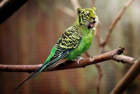|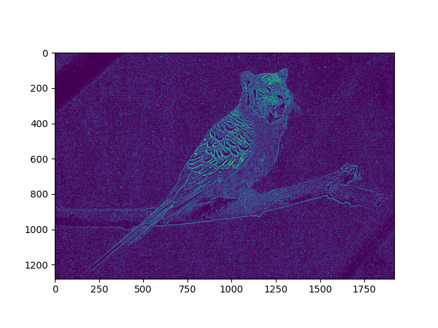|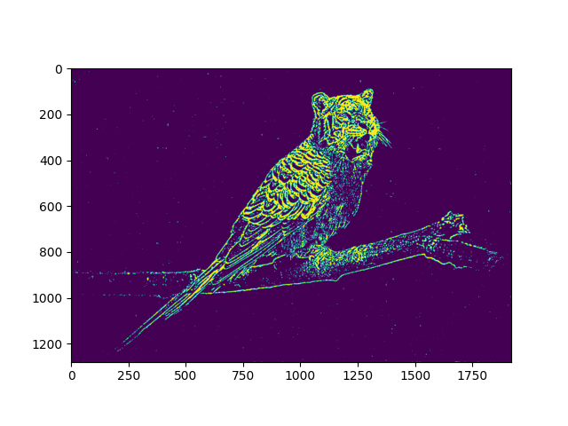|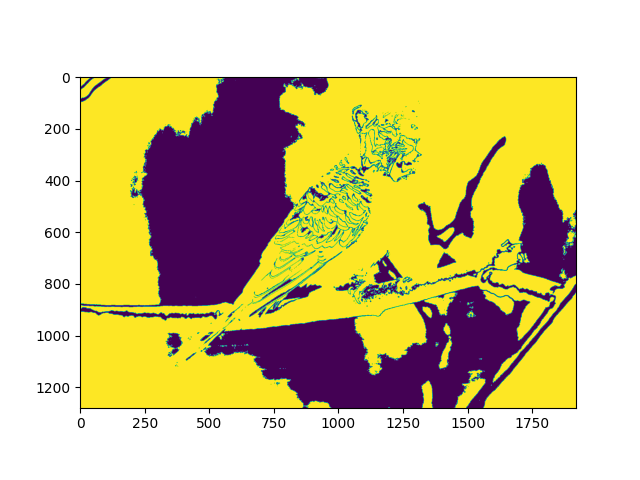|

**Spectral saliency detection**

Hierfür wurde die von OpenCV zur Verfügung gestellte Funktion saliency.StaticSaliencySpectralResidual verwendet und liefert folgendes beispielhaftes Ergebnis:

|Original | Saliency Map|
|---------|-------------|
||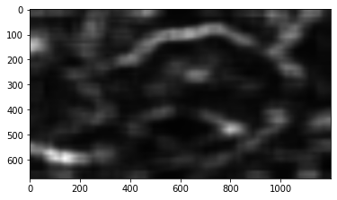|

**Spectral residual detection**

Hierfür wurde die von OpenCV zur Verfügung gestellte Funktion saliency.StaticSaliencySpectralResidual verwendet und liefert folgendes beispielhaftes Ergebnis:

|Original | Saliency Map|
|---------|-------------|
||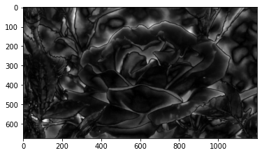|

**Machine Learning**

Konstant gute Saliency Maps werden von dem im Abschnitt 2.2.2 erläuterten neuronalen Netz geliefert. Wir verwenden hier eine Pytorch Implementation[[16]](README.md#quellen) und runden die Werte der Maske vor der weiterverarbeitung.

|Original | Saliency Map|
|---------|-------------|
||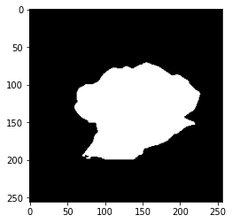|

### 3.3 Implementierung der Umfärbung

Allgemein stützen wir uns auf das in Kapitel 2.3 Beschriebene Vorgehen. Wobei wir daran ein paar Ergänzungen vorgenommen haben die auch in [[10]](https://web.ece.ucsb.edu/~psen/melding) vorgeschlagen werden.
Der in Kapitel 2.3 erwähnte PatchMatch Algorithmus wurde von [[12]](https://github.com/harveyslash/PatchMatch) übernommen.
Die als Input übergebenen Bilder werden als erstes auf dieselbe Größe festgelegt. Für ein gut anzusehendes Ergebnis wäre eine minimale Größe von 500*500 von Nöten, größere Bilder gehen auch man muss dabei nur mit einer höheren Programmlaufzeit rechnen. Um zu vermeiden, dass das Programm um optimale Parameter tau_plus und tau_minus zu finden mehrmals über große Bilder iterieren muss, werden die Bilder mithilfe des Gaußschen Pyramiden Verfahrens verkleinert. Die Verkleinerung findet jeweils in 0.5er Schritten (Verkleinerung auf die Hälfte) statt wobei wir jedes Ergebnis der Verkleinerung in einer Liste speichern. Das Ziel dieser Methodik ist es optimale Parameter tau_plus und tau_minus auf kleinen Bildern zu finden (minimale Größe 125*125) und diese dann auf den Schrittweise größeren Bildern anzuwenden und geringfügig anzupassen. Bei jeder Größenstufe wird das Vorgehen wie in Kapitel 2.3 beschrieben mehrmals durchgeführt wobei die Konvergenz, beschrieben in 2.3.2, als Abbruchkriterium gilt. In unserer Implementierung haben wir uns für eine unterschiedliche Anzahl Iterations pro Größenstufe entschieden. Je kleiner die Bilder, desto häufiger wird iteriert. Des Weiteren sorgen wir dafür, dass der Wert tau_plus den Wert 0.85 nicht übersteigt und tau_minus den Wert 0.2 nicht untersteht.

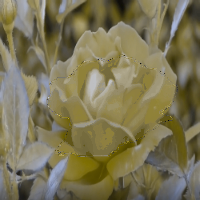

Um das Ergebnis des Patchmatch Algorithmus in unser übergebenes Bild einzufügen, benutzen wir die opencv Funktion "seemlessClone". Beide Bilder werden dabei miteinander vermischt, was folgendes Ergebnis hervorbringt, welches für weitere Iterationen weiterverwendet wird.

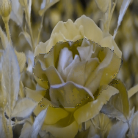

Es gibt zwei Implementierungen der Umfärbung, die sich darin unterscheiden, ob die Bibliothek "pycuda" verwendet wird oder nicht, welches eine schnellere Ausführung des Patchmatch Algorithmus ermöglicht durch Berechnungen auf der GPU. Die Version für die GPU beinhaltet den dargestellten Umfärbungsalgorithmus während der Code für die CPU eine leicht angepasste Version enthält. Die angepasste Version führt die Umfärbung nicht mehr für alle Auflösungsstufen aus, sondern nur für geringe Auflösungen deren Ergebnisse anschließend ein Upsampling erfahren um die originalen Verhältnisse wieder herzustellen. Dies führt zu einer geringeren Qualität des Bildes, hat aber den Vorteil, dass die Ausführungszeit geringer ist.

## 4. Evaluation

Unsere Algorithmen haben wir auf drei verschiedenen Videos getestet. Alle drei Video beinhalten keine Szenenwechsel und keine Cuts. Es ist jeweils immer eine RoI klar zu erkennen bspw. eine Ente oder eine Blume. Unser Ziel war es die RoI im einem normalfarbigen Bild auch in einem simulierten Farbfehlsichtigkeits Bild zu rekonstruieren da es durchaus vorkommen kann, dass in den simulierten Bildern kein herrausstechendes Merkmal vorhanden ist bspw. bei einer Protanopie verschwimmt eine Rote Rose mit dem grünen Hintergrund. An unseren Ergebnissen konnten wir zeigen das uns mithilfe unterschiedlicher Saliency Methoden in Kombination mit einem Umfärbungsalgorithmus die RoI im simulierten Bild etwas herraus stechen lassen konnten.

Die Laufzeiten variieren je nach Auswahl der Algorithmen. Die Berechnung der Salient Frames und der simulierten Frames braucht bei einem Video mit einer Länge von 5 Sekunden und 30 Fps nicht sehr lange. Das Berechnen der umgefärbten Frames wiederum kann bei einem Video mit den gleichen Eigenschaften mehrere Stunden dauern, was vergleichbar mit den Laufzeiten von [[8]](https://link.springer.com/article/10.1007/s00138-018-01000-w) ist. Die Laufzeit limitert unser Projekt für Echtzeitanwendungen dahingehend, da es nicht praktikabel in angemessenem Zeitaufwand einsetzbar ist. Eine weitere Limitierung sind die nicht so hübschen Ränder um die RoI, die durch das Umfärben entstehen. 

Hier sind die simulierten Farbfehlsichtigkeitsbilder jeweils mit einer anderen Typ bei 100 % schwere (Protanopie, Deuteranopie, Tritanopie).

Im Vergleich dazu die umgefärbten Varianten.

Es ist klar in den Videos zu erkennen das nur im Fall der Protanopie eine Umfärbung wirklich notwendig wäre was aber generell gesehen nicht immer der Fall sein muss.
Versucht man das Umgefärbte Bild mithilfe von Clustering Methoden weiterzu bearbeiten um die RoI herrausstechen zulassen kommt folgendes dabei raus.

Das Ergebnis ist ernüchternd und sorgt eher dafür, das die RoI wieder mit dem Hintergrund verschwimmt.

Zusammenfassend kann man sagen, wir konnten in unserem Projekt die Simulation von Bildern aus der Sicht einer farbfehlsichtigen Person realisieren und das mit State of the Art Verfahren. Weiterhin haben wir verschiedene Saliency Methoden implementiert, mit denen wir RoI in Bildern finden konnten und dabei auch State of the Art Techniken verwendet. Diese kommen an unterschiedlichen Stellen bei der Umfärbung zum Einsatz oder können in der API separat durchgeführt werden. Der Umfärbungsalgorithmus kombiniert die zuvor genannten Features und realisiert eine neue Version eines simulierten Bildes, indem die von normalsichtigen Personen als herausstechend wahrgenommenen Bereiche auch im simulierten Bild prägnant hervorgehoben werden.

Man kann definitiv Verbesserungen am Projekt vornehmen, angefangen mit den Laufzeiten, welche dadurch verbessert werden können, indem die Berechnung von optimalen Parametern nicht per Frame, sondern nur einmal pro Video vornimmt. Dies klappt nur unter der Annahme, dass sich die dargestellte Szene im Video nicht ändert. Weiterhin fehlt eine funktionierende Rücktransformation von einem umgefärbten simulierten Bild zu einem normalfarbigen Bild. Somit konnten wir kein Video erzeugen, das für normalsichtige und farbfehlsichtige Personen gleichermaßen gut anzuschauen ist.

Die Zielgruppen für unser Projekt sind in erster Hinsicht jene, die an Krankheiten wie Rot-Grün Schwäche oder Blindheit leiden. Für diese Gruppe soll unsere Applikation eine Möglichkeit bieten, Bereiche die sich farblich kaum bis gar nicht vom Hintergrund unterscheiden, unterscheidbar zu machen. Interessant wäre unsere Applikation auch für Unternehmen, die Produkte wie Filme oder Videospiele für die eben genannte Zielgruppe zugänglicher zu machen.

### Deployment

Eine ausführliche Beschreibung zum Deployment des Projekts findet sich im [Projekt Ordner](project/README.md).

# Arbeitsmatrix
| Feature                            | Person                                |
| ------ | ------ |
| Simulation der Farbfehlsichtigkeit | 80% Michel Judasz, 20% Deborah Höltje |
| Umfärbung                          | 100% Michel Judasz                    |
| Patchmatch Algorithmus             | 100% Michel Judasz                    |
| Benutzeroberfläche/Utils           | 100% Jan Oliver Nörtemann             |
| Bildsegmentierung                  | 100% Jan Oliver Nörtemann             |
| Saliency                           | 100% Deborah Höltje                   |

### Quellen
[1]: Li, J., Feng, X. & Fan, H. "Saliency-based image correction for colorblind patients.", Comp. Visual Media 6, 169–189 (2020).

[2]: https://www.color-blindness.com/coblis-color-blindness-simulator .

[3]: Hans Brettel, Françoise Viénot, and John D. Mollon, "Computerized simulation of color appearance for dichromats," J. Opt. Soc. Am. A 14, 2647-2655 (1997)

[4]: Gustavo M. Machado, Manuel M. Oliveira, and Leandro A. F. Fernandes, "A Physiologically-based Model for Simulation of Color Vision Deficiency". IEEE Transactions on Visualization and Computer Graphics. Volume 15 (2009), Number 6, November/December 2009. pp. 1291-1298.

[5]: https://www.inf.ufrgs.br/~oliveira/pubs_files/CVD_Simulation/CVD_Simulation.html . 

[6]: https://github.com/MaPePeR/jsColorblindSimulator . 

[7]: DBV 01_ImageAquisition Folie 27 und https://en.wikipedia.org/wiki/Cone_cell

[8]: Mechrez, R., Shechtman, E. & Zelnik-Manor, L. Saliency driven image manipulation. Machine Vision and Applications 30, 189–202 (2019).

[9]: Connelly Barnes, Eli Shechtman, Adam Finkelstein, and Dan B Goldman, "PatchMatch: A Randomized Correspondence Algorithm for Structural Image Editing.", ACM Transactions on Graphics (Proc. SIGGRAPH) 28(3), August 2009.

[10]: Soheil Darabi and Eli Shechtman and Connelly Barnes and Dan B Goldman and Pradeep Sen, "Image Melding: Combining Inconsistent Images using Patch-based Synthesis", ACM Transactions on Graphics (TOG) (Proceedings of SIGGRAPH 2012), 2012.

[11]: https://daltonlens.org/understanding-cvd-simulation/#Simulating-dichromacy-in-LMS-(Brettel-1997-and-Vi%C3%A9not-1999) .

[12]: https://github.com/harveyslash/PatchMatch .

[13]: R. Achanta, S. Hemami, F. Estrada and S. Susstrunk, "Frequency-tuned salient region detection", 2009 IEEE Conference on Computer Vision and Pattern Recognition, 2009.

[14]: Sebastian Montabone, Alvaro Soto, "Human detection using a mobile platform and novel features derived from a visual saliency mechanism", Image and Vision Computing, 2010.

[15]: X. Hou and L. Zhang, "Saliency Detection: A Spectral Residual Approach", 2007 IEEE Conference on Computer Vision and Pattern Recognition, 2007.

[16]: https://github.com/sairajk/PyTorch-Pyramid-Feature-Attention-Network-for-Saliency-Detection . 

[17]: T. Zhao and X. Wu, "Pyramid Feature Attention Network for Saliency Detection", 2019 IEEE/CVF Conference on Computer Vision and Pattern Recognition (CVPR), 2019.

[18]: A. K. Gupta, D. J. Bora, "A Novel Color Image Segmentation Approach Based On K-Means Clustering with Proper Determination of the Number of Clusters and Suitable Distance Metric, International Journal of Computer Science & Engineering Technology (IJCSET), 2016
